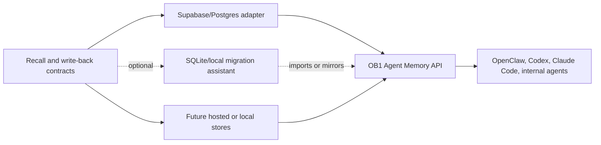

# OB1 Agent Memory Storage Portability

V1 ships on Supabase/Postgres because OB1 is built there now. The product requirement is not to ship SQLite support in v1. The requirement is to keep the recall and write-back contracts clean enough that future storage adapters, importers, or migration assistants can exist without changing runtime behavior.

## Adapter Boundary

| Responsibility | Contract Level | Adapter Level |
| -------------- | -------------- | ------------- |
| Request shape | Recall and write-back schemas | Validate and map fields |
| Storage | Memory categories, provenance, use policy | Tables, indexes, embeddings, FTS |
| Ranking | Required ranking inputs | Scoring implementation |
| Review | Review actions and states | UI/storage implementation |
| Audit | Required event types | Durable log implementation |

## Optional Migration Assistant Shape

SQLite came up as a personal workflow and future convenience path, not a launch blocker for OB1. If we build it later, it should look like a migration or sync assistant rather than a second official backend.

An optional local migration assistant could preserve:

- the same recall/write-back JSON contracts
- export/import mappings for memories, source refs, artifacts, relations, review actions, recall traces, recall items, and audit events
- FTS5 or sqlite-vec retrieval for local inspection
- idempotency keys and content hashes
- evidence-vs-instruction use policy

Do not fork the runtime contract for SQLite. Treat it as an importer, mirror, or personal adapter after the OpenClaw launch path is real.
