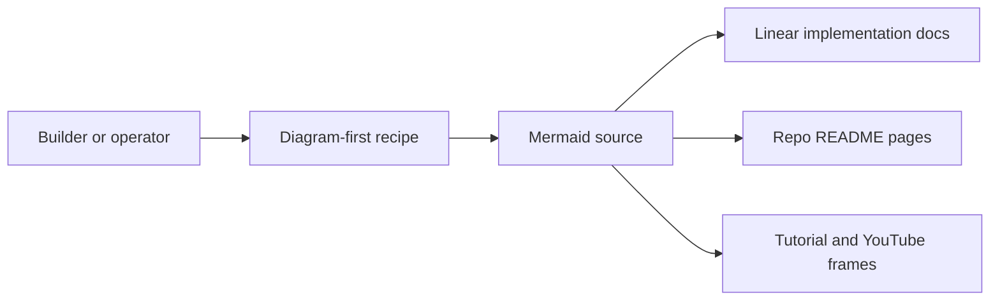

# OB1 Agent Memory Visual Assets



These diagrams are the shared visual language for the OB1 Agent Memory launch. Every public-facing Agent Memory recipe should start with one of these diagrams, then one short explanation, then copy-paste setup.

## Asset Catalog

| Source | Use |
| ------ | --- |
| [continuity-layer.mmd](continuity-layer.mmd) | Explain OB1 as the continuity layer across runtimes, models, and channels |
| [agent-memory-loop.mmd](agent-memory-loop.mmd) | Show the core recall, work, write-back, review, reuse loop |
| [recall-lifecycle.mmd](recall-lifecycle.mmd) | Explain pre-task recall and use policy |
| [writeback-lifecycle.mmd](writeback-lifecycle.mmd) | Explain post-task compact memory creation |
| [trust-ladder.mmd](trust-ladder.mmd) | Explain why inferred memory is evidence until confirmed |
| [data-model-er.mmd](data-model-er.mmd) | Engineering view of the sidecar schema |
| [review-queue-flow.mmd](review-queue-flow.mmd) | Product view of review and confirmation |
| [recall-trace-debug.mmd](recall-trace-debug.mmd) | Debug flow for bad agent behavior |
| [openclaw-plugin-skill-distribution.mmd](openclaw-plugin-skill-distribution.mmd) | OpenClaw plugin plus ClawHub skill publishing story |
| [code-review-workflow.mmd](code-review-workflow.mmd) | Flagship Code Review Memory workflow |
| [taskflow-work-log-handoff.mmd](taskflow-work-log-handoff.mmd) | TaskFlow handoff workflow |
| [evaluation-dashboard.mmd](evaluation-dashboard.mmd) | Evaluation and quality metrics view |

## Export Targets

Generated files belong in:

| Folder | Format |
| ------ | ------ |
| [exports](exports/) | SVG and PNG files for repo docs |
| [linear](linear/) | 16:9 PNGs attached to Linear issues |
| [video](video/) | 16:9 tutorial frames for Nate's videos |

## Export Command

Use Mermaid CLI from the repo root when packaging assets:

```bash
npx -y @mermaid-js/mermaid-cli -i docs/assets/agent-memory/agent-memory-loop.mmd -o docs/assets/agent-memory/exports/agent-memory-loop.svg
```

For Linear and video, export PNG at a 16:9 viewport:

```bash
npx -y @mermaid-js/mermaid-cli -i docs/assets/agent-memory/continuity-layer.mmd -o docs/assets/agent-memory/linear/continuity-layer.png -w 1920 -H 1080
```

Mermaid may crop to diagram bounds. Pad final PNGs to true 1920x1080 before handing them to Linear or video:

```bash
sips --padToHeightWidth 1080 1920 --padColor FFFFFF docs/assets/agent-memory/linear/continuity-layer.png
```

Keep the `.mmd` files as the source of truth so product, engineering, and tutorial assets do not drift.
