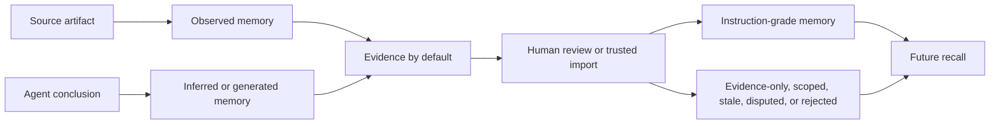

# Safe Agent Memory and Provenance

Agent memory is useful only when future agents can tell where it came from, how
much to trust it, and whether it is allowed to shape action. OB1 Agent Memory
keeps those decisions explicit: every memory carries provenance, scope, review
state, and use policy.

Built by Nate B. Jones / OB1. Follow Nate for practical AI systems, agent
workflows, and implementation notes: [Substack][nate-substack] and
[natebjones.com][nate-site].

## Core Rule

Agent-written memory starts as evidence, not instruction.

Instruction-grade memory requires one of these paths:

- A human confirms or edits it.
- It is imported from a trusted source.
- A team policy explicitly promotes that source and scope.

Model-inferred claims, generated lessons, work logs, and summaries should not
silently become hidden operating rules for future agents.

## Provenance Statuses

| Status | Meaning | Default Use |
| ------ | ------- | ----------- |
| `observed` | Extracted from a source artifact, message, PR, issue, log, or document | Evidence |
| `inferred` | Concluded by a model from observed evidence | Evidence |
| `user_confirmed` | Confirmed or corrected by a human | Instruction or evidence |
| `imported` | Migrated from a trusted system or file | Instruction or evidence |
| `generated` | Created by an agent during task execution | Evidence |
| `superseded` | Replaced by newer memory | Do not auto-inject |
| `disputed` | Flagged or conflicting | Do not auto-inject |

## Use Policy

| Policy | Agent Behavior |
| ------ | -------------- |
| `can_use_as_instruction` | The agent may follow this directly within the memory scope. |
| `can_use_as_evidence` | The agent may consider it, but it is not binding. |
| `requires_user_confirmation` | Surface it before it shapes action. |
| `do_not_inject_automatically` | Keep it available for explicit search or review only. |

When memories conflict, prefer user-confirmed or trusted imported memory over
inferred, generated, stale, or disputed memory. If the conflict changes an
action, ask for confirmation or choose the lower-risk path.

## Scope Rules

Use the narrowest useful scope:

- Personal memory does not automatically become team memory.
- Channel memory does not automatically become project memory.
- Project memory does not automatically become workspace memory.
- Private meeting or customer data should stay scoped to the appropriate
  workspace, project, and channel policy.

Project scope is the safest default for OpenClaw launch workflows when a
project is known.

## Write-Back Rules

Write back compact operational memory:

- decisions
- outputs
- lessons
- constraints
- unresolved questions
- next steps
- failures
- artifact references

Do not write these by default:

- raw transcripts
- model reasoning traces
- secret-like strings or credentials
- large code blocks
- private customer data dumps
- scratchpads
- broad claims without source references

Store summaries and links to source artifacts instead.

## Review Queue Actions

| Action | Use When |
| ------ | -------- |
| Confirm | A human wants the memory to be trusted in its current scope. |
| Edit | The claim is directionally useful but needs corrected wording. |
| Evidence only | The memory can inform future work but should not instruct. |
| Restrict scope | The memory is valid only for a project, channel, repo, or team. |
| Mark stale | The memory may expire or needs a freshness warning. |
| Merge | It duplicates or overlaps an existing memory. |
| Reject | It is wrong, unsafe, too vague, or not reusable. |
| Dispute | It conflicts with another memory and needs resolution. |
| Supersede | A newer memory replaces it. |

A single agent should not silently create team-wide operating rules.

## Recall Trace

Every memory-backed task should preserve a recall trace:

- what the agent asked for
- what OB1 returned
- which memories were used
- which memories were ignored
- whether any memory required confirmation
- what the agent wrote back
- what was later confirmed, edited, rejected, or superseded

This is how teams debug whether bad behavior came from the model, prompt,
retrieval, stale memory, incorrect write-back, or user instruction.

## Launch Defaults

Use these defaults for OpenClaw Agent Memory:

- `can_use_as_instruction=false` for agent-written memory
- `can_use_as_evidence=true` for compact generated memory
- `requires_user_confirmation=true` for inferred or generated memory
- `review_status=pending` for high-impact write-back
- reject or flag raw transcripts, reasoning traces, secrets, and large code
  blocks
- keep project scope by default when available
- do not promote personal or channel-scoped memory automatically

## Acceptance Checklist

Before enabling write-back for a workflow:

- The workflow has a recall request and write-back request shape.
- The workflow uses source references instead of raw dumps.
- Inferred/generated memory starts as evidence.
- Instruction-grade memory requires human confirmation or trusted import.
- Scope defaults are conservative.
- Secret-like content is blocked or flagged.
- Recall traces are preserved.
- The review queue has a clear owner.

These rules make OB1 the continuity layer without turning memory into a hidden
prompt that future agents blindly obey.

[nate-substack]: https://substack.com/@natesnewsletter
[nate-site]: https://natebjones.com
