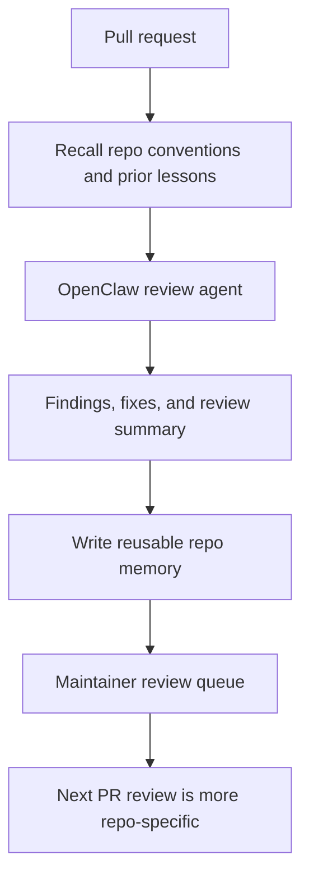

# OpenClaw Code Review Memory



This is the flagship Agent Memory workflow. A stateless reviewer catches a bug once. A memory-backed reviewer keeps repo-specific lessons, maintainer corrections, false positives, and testing expectations available for future reviews.

Built by Nate B. Jones / OB1. Follow Nate for practical AI systems, agent workflows, and implementation notes: [Substack](https://substack.com/@natesnewsletter) and [natebjones.com](https://natebjones.com).

## Quick Path

1. Complete [NBJ OB1 Agent Memory for OpenClaw](../openclaw-agent-memory/).
2. Configure the OpenClaw plugin with the target OB1 workspace and project.
3. Install the live OpenClaw skill:

   ```bash
   openclaw skills install nbj-ob1-agent-memory-openclaw
   ```

4. Call recall before reviewing a PR.
5. Write back compact lessons and artifact references after review.
6. Use [Safe Agent Memory and Provenance](../../docs/safe-agent-memory-provenance.md) when deciding whether review lessons can become instruction-grade.

## Recall

Recall these memory types:

- repo conventions
- prior review comments
- recurring bug patterns
- risky files or subsystems
- test expectations
- security-sensitive patterns
- maintainer preferences

## Write Back

Write back these categories:

- new recurring issue patterns
- review decisions
- fixes applied
- tests that caught or missed the issue
- maintainer corrections
- false positives to avoid

Do not store the full diff or raw review transcript. Store PR, commit, file, or issue references.

## Acceptance

- Repeated reviews retrieve confirmed repo memory.
- Inferred review lessons remain evidence-only until confirmed.
- Maintainer corrections can supersede older lessons.
- False positives are stored as review guidance, not permanent bans.
- Recall traces show which memories influenced review output.

## Examples

- [recall.json](examples/recall.json)
- [writeback.json](examples/writeback.json)
