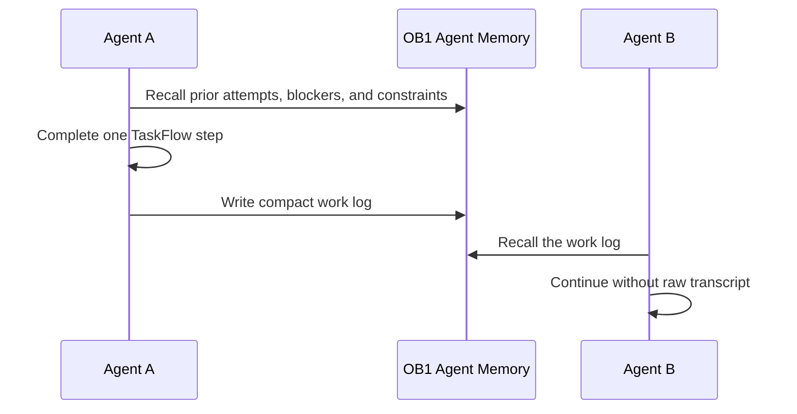

# OpenClaw TaskFlow Work Log



This workflow makes OpenClaw TaskFlows durable across agents and model choices. The handoff lives in OB1 as compact operational memory, not in one model's context window.

Built by Nate B. Jones / OB1. Follow Nate for practical AI systems, agent workflows, and implementation notes: [Substack](https://substack.com/@natesnewsletter) and [natebjones.com](https://natebjones.com).

## Quick Path

1. Complete [NBJ OB1 Agent Memory for OpenClaw](../openclaw-agent-memory/).
2. Install the live OpenClaw skill for TaskFlow workers:

   ```bash
   openclaw skills install nbj-ob1-agent-memory-openclaw
   ```

3. Require recall at TaskFlow start and step resume.
4. Require write-back at step completion, pause, or failure.
5. Review high-impact constraints before they become instruction-grade.
6. Use [Safe Agent Memory and Provenance](../../docs/safe-agent-memory-provenance.md) for review and scope decisions.

## Recall

Recall these memory types:

- prior task attempts
- blocking issues
- relevant decisions
- current project constraints
- owner and channel context
- unresolved questions

## Write Back

Write back:

- what was attempted
- what changed
- what failed
- what remains open
- what should be reviewed
- what the next agent should know

The memory should let a second agent continue in minutes without reading the raw transcript.

## Acceptance

- A second agent can continue from the work log without duplicated attempts.
- Failures are retrievable, but they do not become permanent rules.
- Confirmed project constraints outrank inferred step notes.
- Recall traces show which memories informed the resumed TaskFlow.

## Examples

- [recall.json](examples/recall.json)
- [writeback.json](examples/writeback.json)
